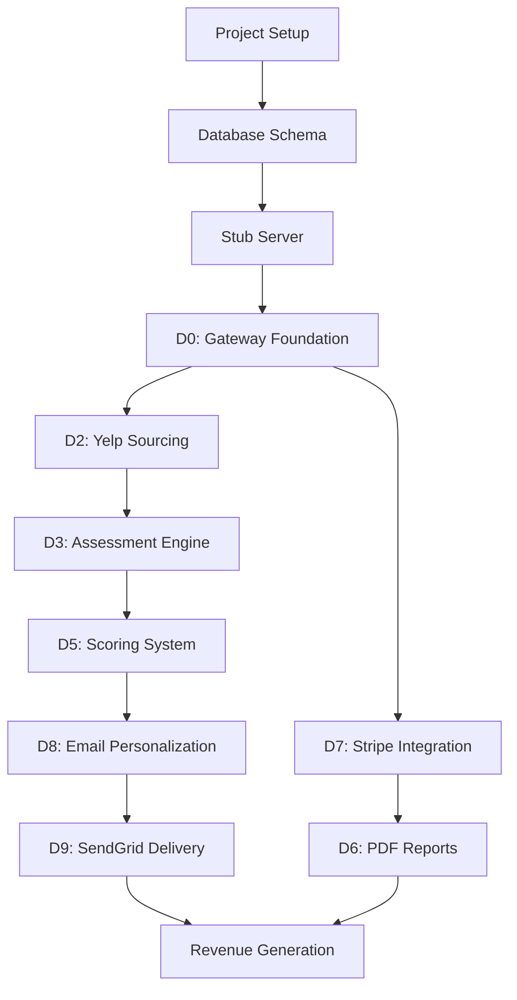

# LeadFactory MVP - Complexity Assessment

## Executive Summary

The LeadFactory MVP is a highly complex project with **100+ interdependent tasks** across 12 domains (D0-D11). The critical path through the system requires careful orchestration to meet the 48-72 hour revenue target.

### Overall Complexity Score: 8.5/10

**Key Factors:**
- Multiple external API integrations (Yelp, PageSpeed, OpenAI, Stripe, SendGrid)
- Real-time payment processing and report generation
- Complex scoring algorithm with vertical-specific rules
- Stringent performance requirements (5k businesses in 4 hours)
- CI-first development with zero local/CI discrepancies

## 1. Task Dependencies & Critical Paths

### 1.1 Primary Critical Path (Revenue Generation)



**Minimum Time to Revenue: 36-48 hours** (assuming perfect execution)

### 1.2 Secondary Critical Paths

1. **Testing Infrastructure Path** (8-10 hours)
   - Docker test environment → CI pipeline → Test utilities → Fixtures

2. **Data Pipeline Path** (12-16 hours)
   - Models → Migrations → CRUD operations → Batch processing

3. **Monitoring Path** (6-8 hours)
   - Prometheus metrics → Logging → Error tracking → Dashboards

## 2. Resource Requirements

### 2.1 Development Resources

**Single Developer Bandwidth:**
- **Focus Time:** 10-12 hour blocks required for complex integrations
- **Context Switching:** Minimize to <3 domain switches per day
- **AI Assistant Usage:** 80% of coding through Claude Code

**Estimated Time by Domain:**
```
D0 Gateway:        8-10 hours (complex rate limiting, circuit breakers)
D1 Targeting:      4-6 hours  (simpler CRUD operations)
D2 Sourcing:       6-8 hours  (Yelp API complexity, pagination)
D3 Assessment:     10-12 hours (multiple sub-assessments, parallel execution)
D4 Enrichment:     4-6 hours  (fuzzy matching complexity)
D5 Scoring:        8-10 hours (rule engine, YAML configuration)
D6 Reports:        8-10 hours (PDF generation, template complexity)
D7 Storefront:     10-12 hours (Stripe webhooks, idempotency)
D8 Personalization: 6-8 hours  (LLM integration, spam scoring)
D9 Delivery:       8-10 hours (SendGrid webhooks, compliance)
D10 Analytics:     4-6 hours  (basic metrics only for MVP)
D11 Orchestration: 6-8 hours  (Prefect setup, error handling)

Total: 82-106 hours of development time
```

### 2.2 Infrastructure Resources

**Development Machine:**
- Mac Mini M4: Sufficient for all tasks
- Docker: 4-6GB RAM allocation needed
- Concurrent containers: Max 3 (test, stub server, database)

**External Service Quotas:**
```
Yelp API:      5,000 calls/day (hard limit)
PageSpeed API: 25,000 calls/day
OpenAI:        $50/day budget (~5,000 assessments)
SendGrid:      100 emails/day (deliverability limit)
```

## 3. Risk Factors

### 3.1 High-Risk Areas (Probability × Impact)

1. **Stripe Webhook Reliability** (High/Critical)
   - Risk: Payment succeeded but report generation fails
   - Mitigation: Idempotent webhook processing, retry queues

2. **Email Deliverability** (High/Critical)
   - Risk: Emails land in spam, no opens/clicks
   - Mitigation: Warm-up period, spam scoring, A/B testing

3. **API Rate Limits** (Medium/High)
   - Risk: Hit Yelp limit mid-batch
   - Mitigation: Precise quota tracking, graceful degradation

4. **PDF Generation at Scale** (Medium/High)
   - Risk: Memory/CPU exhaustion with concurrent PDFs
   - Mitigation: Queue system, resource pooling

5. **LLM Costs** (Medium/Medium)
   - Risk: Exceed $0.02/lead budget
   - Mitigation: Prompt optimization, caching similar assessments

### 3.2 Technical Debt Risks

1. **SQLite in Production** (Acceptable for MVP)
   - Plan PostgreSQL migration for Week 2

2. **No Queue System** (High risk at scale)
   - Add Celery/RabbitMQ after revenue validation

3. **Basic Error Handling** (Medium risk)
   - Enhance after first production issues

## 4. Parallelization Opportunities

### 4.1 Parallel Development Tracks

**Track 1: Core Pipeline** (Developer Focus)
- D0 → D2 → D3 → D5 → D8 → D9

**Track 2: Revenue Systems** (Can be developed in parallel)
- D7 (Stripe) → D6 (Reports)

**Track 3: Infrastructure** (AI Assistant can handle)
- Database models
- Docker setup
- CI configuration
- Stub server

### 4.2 Parallel Execution Opportunities

1. **Assessment Phase** (3x speedup possible)
   ```python
   # Can run simultaneously
   - PageSpeed analysis
   - Tech stack detection  
   - LLM insights
   ```

2. **Batch Processing** (10x speedup possible)
   ```python
   # Process multiple geo×vertical batches concurrently
   # Limit: API quotas and memory
   ```

3. **Email Delivery** (Bounded by SendGrid)
   ```python
   # Batch API calls but respect rate limits
   # Max: 10 emails per API call
   ```

## 5. Bottlenecks in 48-72 Hour Timeline

### 5.1 Critical Bottlenecks

1. **Stripe Webhook Testing** (4-6 hours)
   - Cannot parallelize
   - Requires careful testing of all edge cases
   - Blocks revenue generation

2. **End-to-End Integration Testing** (6-8 hours)
   - Must test full flow: Yelp → Email → Payment → Report
   - Catches integration issues
   - Cannot skip without high risk

3. **Docker CI Environment** (2-4 hours per issue)
   - Any environment mismatch costs hours
   - Must match production exactly

### 5.2 Non-Critical But Time-Consuming

1. **Comprehensive Monitoring** (defer to Week 2)
2. **A/B Testing Framework** (defer to Week 2)
3. **Advanced Analytics** (basic metrics only for MVP)

## 6. Execution Strategy Recommendations

### 6.1 Day 1 (Hours 0-24)
**Goal: Foundation + Core Pipeline Skeleton**

Morning (0-8h):
- Project setup, dependencies, Docker environment
- Database schema and models
- Stub server for testing

Afternoon (8-16h):
- D0 Gateway base implementation
- D2 Yelp sourcing with tests
- Basic D3 assessment structure

Evening (16-24h):
- D5 Scoring engine core
- Integration tests for pipeline
- CI pipeline setup

### 6.2 Day 2 (Hours 24-48)
**Goal: Complete Pipeline + Payment Flow**

Morning (24-32h):
- D8 Email personalization
- D9 SendGrid integration
- D7 Stripe checkout flow

Afternoon (32-40h):
- D7 Webhook processing
- D6 Report generation
- End-to-end testing

Evening (40-48h):
- D11 Prefect orchestration
- Production deployment prep
- Final integration tests

### 6.3 Day 3 (Hours 48-72)
**Goal: Production Launch + First Revenue**

Morning (48-56h):
- Deploy to production
- Run small test batch (10 businesses)
- Monitor all metrics

Afternoon (56-64h):
- Fix any production issues
- Scale to 100 businesses
- Send first real emails

Evening (64-72h):
- Monitor conversions
- Handle first purchases
- Iterate on email content

## 7. Resource Optimization Strategies

### 7.1 AI Assistant Optimization

1. **Batch Similar Tasks**
   - All model creation in one session
   - All API client implementations together
   - All test writing in blocks

2. **Provide Complete Context**
   - Always reference PRD sections
   - Include test examples
   - Show expected output

3. **Minimize Clarification Rounds**
   - Over-specify rather than under-specify
   - Include error cases upfront

### 7.2 Time Optimization

1. **Skip Non-Critical Features**
   - No admin UI
   - Basic email templates only
   - Minimal analytics

2. **Use Existing Libraries**
   - SQLAlchemy for ORM (no custom)
   - Prefect for orchestration (no custom)
   - Playwright for PDF (no wkhtmltopdf)

3. **Defer Optimizations**
   - No caching initially (add if needed)
   - Basic error handling only
   - No performance tuning until after revenue

## 8. Success Metrics & Checkpoints

### 8.1 Technical Checkpoints

**Hour 12:** Docker tests passing for D0, D2
**Hour 24:** Full pipeline test (mock data) passing
**Hour 36:** Stripe payment flow working
**Hour 48:** First email sent to real business
**Hour 60:** First payment received
**Hour 72:** 10+ payments processed

### 8.2 Business Checkpoints

**Day 1:** Technical foundation complete
**Day 2:** Revenue systems operational  
**Day 3:** First revenue generated

### 8.3 Go/No-Go Criteria

**MUST HAVE for Launch:**
- [ ] 500+ businesses assessed
- [ ] 50+ emails sent without bounces
- [ ] Stripe payments working
- [ ] PDF reports generating
- [ ] Basic monitoring active

**NICE TO HAVE:**
- [ ] A/B testing active
- [ ] Advanced analytics
- [ ] Auto-scaling ready

## 9. Contingency Plans

### 9.1 If Behind Schedule

**Option 1: Reduce Scope** (saves 8-12 hours)
- Skip D4 Enrichment 
- Basic email templates only
- Manual report triggering

**Option 2: Manual Processes** (saves 4-6 hours)
- Manual batch triggering
- Manual payment verification
- Email sends in small batches

**Option 3: Defer Polish** (saves 6-8 hours)
- Basic error messages
- No retry logic
- Minimal logging

### 9.2 If APIs Fail

**Yelp API Down:**
- Use cached test data
- Process yesterday's batch

**PageSpeed API Down:**
- Skip performance scoring
- Use LLM-only assessment

**SendGrid Down:**
- Queue emails for later
- Use backup SMTP

## 10. Key Success Factors

### 10.1 What Will Make or Break This Project

1. **Stripe Integration Quality**
   - Must handle all edge cases
   - Webhook reliability critical
   - Test mode → Live mode transition

2. **Email Deliverability**
   - Subject lines must avoid spam filters
   - Content must drive clicks
   - Landing pages must convert

3. **Assessment Quality**
   - Issues must be real and valuable
   - Recommendations must be actionable
   - Reports must look professional

4. **Execution Discipline**
   - Stick to critical path
   - Don't over-engineer
   - Test in Docker always

### 10.2 Final Recommendations

1. **Start with Integration Tests**
   - Write end-to-end test first
   - Build features to pass test
   - Catches issues early

2. **Deploy Early and Often**
   - Production environment by Day 2
   - Test with real data ASAP
   - Monitor everything

3. **Focus on Revenue Path**
   - Every task should drive toward first payment
   - Defer anything not on critical path
   - Optimize after revenue proven

---

**Timeline Confidence: 65%** - Achievable with focused execution and minimal surprises
**Revenue Confidence: 70%** - Solid plan, main risk is email deliverability
**Technical Confidence: 85%** - Well-architected, proven technologies